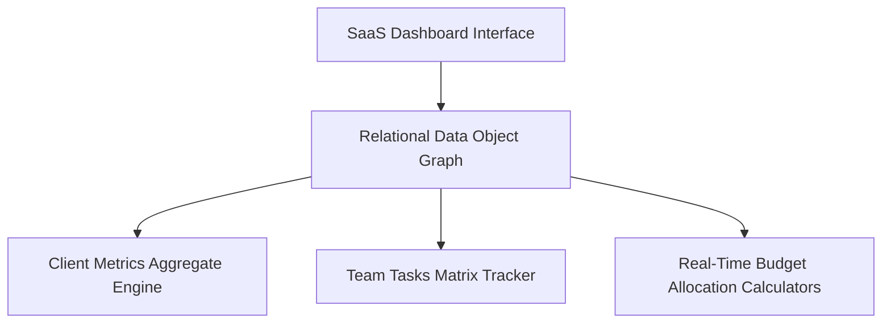

# 💼 B2B Corporate Project Tracker
[🔗 Click Here to Launch the Live Web App](https://netlify.app)

An enterprise-grade SaaS project management control center built to monitor multi-tenant client portfolios, high-velocity team task structures, and relational operational budgets. Designed with a strict focus on memory-efficient relational data management.

## 🏗️ Core Technical Architecture & Logic

- **Nested Relational Data Graphs:** Utilizes complex object trees to link Parent Entities (Clients) down to nested Child Nodes (Projects and Tasks) using pointer-like unique ID references. This guarantees full relational integrity across the entire application runtime state without database overhead.
- **High-Velocity Analytical Compilers:** Implements highly efficient cumulative calculation functions (similar to utilizing `std::accumulate` in C++ or list operations in Python) to compute total client metrics, cross-project budgets, and percentage task completions on the fly upon any micro-state mutation.
- **Resource Boundary Protection:** Features architectural state blocks preventing budget allocations from over-specifying available funding pools. Uses explicit type conversions and deterministic verification checks to maintain analytical tracking accuracy across highly sensitive corporate metrics fields.

## 🛠️ Tech Stack & Systems Environment
- **Core Engine:** TypeScript / JavaScript (ES6+)
- **State Framework:** Modern Client-Side Context Operations
- **Layout & Design Systems:** Tailwind CSS / Tailwind Typography
- **Deployment Platform:** Netlify Cloud Pipeline
